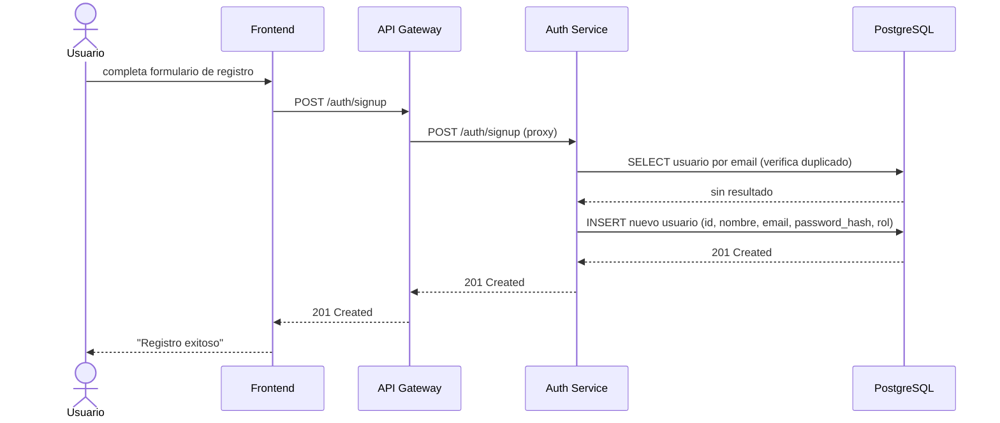
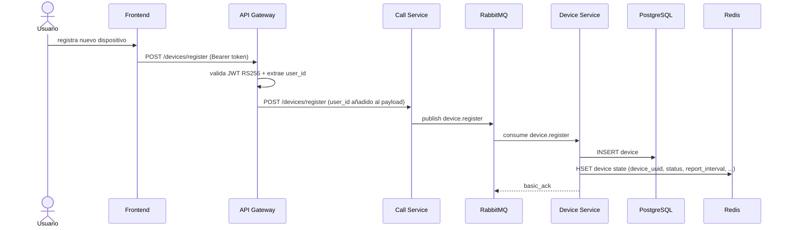
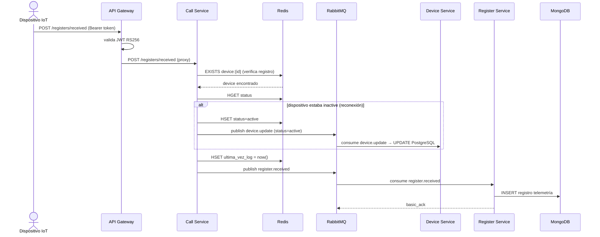
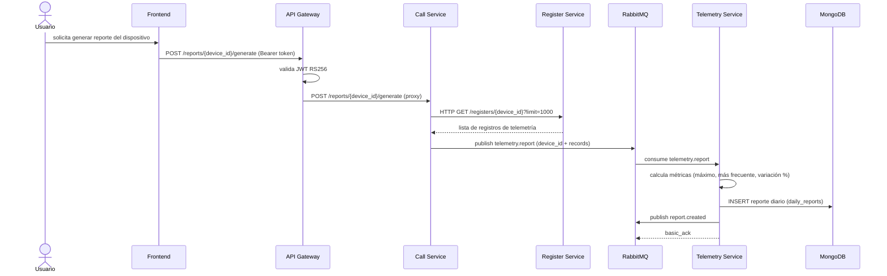
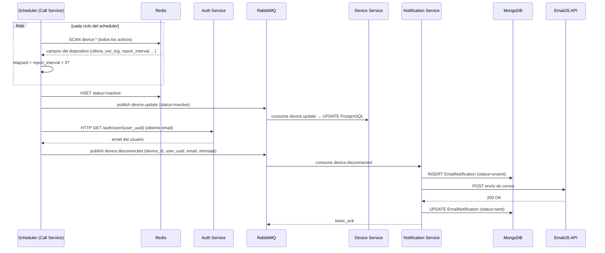
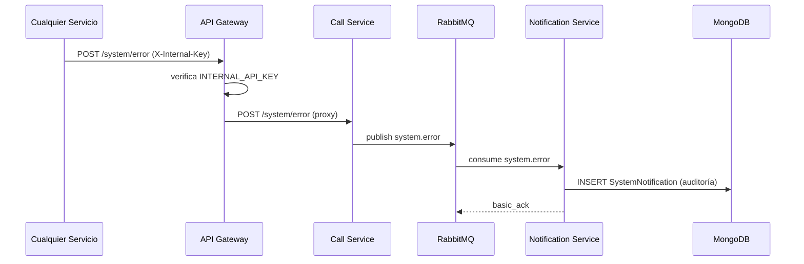

# Arquitectura — Ioteur

---

## Estilo Arquitectónico

Ioteur sigue una arquitectura de **microservicios** desacoplados que se comunican mediante dos mecanismos:

1. **HTTP/REST sincrónico** — para consultas que requieren respuesta inmediata (API Gateway → Auth/Call Services, Call Service → servicios internos).
2. **Mensajería asíncrona vía RabbitMQ** — para operaciones de escritura y eventos que pueden procesarse en background sin bloquear al cliente.

---

## Diagrama de Arquitectura

## Descripción de Servicios

### API Gateway (`:8000`)

**Responsabilidad:** Único punto de entrada para los clientes externos.

- Valida y decodifica tokens JWT RS256.
- Aplica RBAC: diferencia rutas de `user` y `admin`.
- Actúa como proxy inverso hacia `auth-service` y `call-service`.
- No tiene base de datos propia; usa Redis para verificar tokens en la blacklist (logout).

**Dependencias de arranque:** `auth-service` (healthy), `call-service` (healthy).

---

### Auth Service (`:8001`)

**Responsabilidad:** Gestión de identidad y autenticación.

- CRUD de usuarios (sign up, login, update, delete).
- Emite `access_token` (JWT, 15 min) y `refresh_token` (JWT, 7 días) firmados con RS256.
- Almacena tokens revocados en Redis (blacklist para logout).
- Persiste usuarios en PostgreSQL.

**Dependencias de arranque:** `postgres-auth` (healthy), `redis-auth` (healthy).

---

### Call Service (`:8002`)

**Responsabilidad:** Orquestador del dominio de negocio IoT.

- Recibe peticiones del API Gateway y las convierte en eventos o en consultas HTTP a servicios internos.
- **Publica** eventos en RabbitMQ (`device.register`, `device.update`, `register.received`, `device.disconnected`, `telemetry.report`, `system.error`).
- **Consulta** sincrónicamente a `device-service`, `register-service` y `telemetry-service` para operaciones de lectura.
- Mantiene el estado de los dispositivos en Redis y ejecuta un **trabajo periódico** que escanea todos los dispositivos en Redis, detecta cuáles superan su `report_interval`, publica `device.disconnected` y notifica al usuario.

**Dependencias de arranque:** `redis_device` (healthy), `rabbitmq` (healthy).

---

### Device Service (`:8003`)

**Responsabilidad:** Fuente de verdad de los dispositivos registrados.

- Persiste dispositivos en PostgreSQL (con `device_uuid`, `mac_address`, `report_interval`, `status`, etc.).
- Al registrar un dispositivo, lo escribe también en Redis como cache de estado.
- **Suscribe** a los eventos `device.register` y `device.update` desde RabbitMQ.
- Expone endpoints HTTP internos de lectura para que Call Service consulte dispositivos.

**Dependencias de arranque:** `rabbitmq` (healthy), `postgres-device` (healthy), `redis_device` (healthy).

---

### Register Service (`:8005`)

**Responsabilidad:** Almacenamiento de registros de telemetría.

- **Suscribe** al evento `register.received` desde RabbitMQ.
- Persiste cada registro en MongoDB (`register` collection) con valores arbitrarios como documento.
- Expone endpoints HTTP internos de lectura con paginación y filtro por fecha.
- Implementa reintentos (hasta 3 veces) ante fallos de inserción en MongoDB.

**Dependencias de arranque:** `mongo_register` (healthy), `rabbitmq` (healthy).

---

### Telemetry Service (`:8006`)

**Responsabilidad:** Generación de reportes de telemetría.

- **Suscribe** al evento `telemetry.report` desde RabbitMQ.
- Calcula métricas por campo de los registros recibidos: lista de valores, variación porcentual, valor máximo, valor más frecuente.
- Persiste el reporte diario en MongoDB (`daily_reports` collection).
- Publica el evento `report.created` al finalizar.
- Expone endpoints HTTP internos de lectura con paginación y filtro por fecha.

**Dependencias de arranque:** `mongo_telemetry` (healthy), `rabbitmq` (healthy).

---

### Notification Service (`:8004`)

**Responsabilidad:** Envío de notificaciones y registro de errores del sistema.

- **Suscribe** a los eventos `device.disconnected` y `system.error` desde RabbitMQ.
- Al recibir `device.disconnected`: persiste un `EmailNotification` en MongoDB (status=`unsent`) y envía el correo vía EmailJS. Si el envío es exitoso, actualiza el status a `sent`.
- Al recibir `system.error`: persiste un `SystemNotification` en MongoDB para auditoría.

**Dependencias de arranque:** `mongo_notifications` (healthy), `rabbitmq` (healthy).

---

## Infraestructura de Datos

| Base de datos | Instancia Docker | Utilizada por | Propósito |
|---|---|---|---|
| PostgreSQL 16 | `postgres-auth` | auth-service | Tabla `users` |
| PostgreSQL 16 | `postgres-device` | device-service | Tabla `devices` |
| Redis 7 | `redis-auth` | auth-service | Blacklist de refresh tokens |
| Redis 7 | `redis_device` | call-service, device-service | Estado de dispositivos (heartbeat) |
| MongoDB 8 | `mongo_register` | register-service | Colección `register` (telemetría) |
| MongoDB 8 | `mongo_notifications` | notification-service | Colecciones `email_notifications`, `system_notifications` |
| MongoDB 8 | `mongo_telemetry` | telemetry-service | Colección `daily_reports` |

---

## Bus de Mensajes

**Exchange:** `ioteur` — tipo `direct`, durable.

Todos los mensajes son persistentes (`delivery_mode=2`). Los consumidores usan `basic_ack` al procesar correctamente y `basic_nack` (sin requeue) ante errores irrecuperables.

| Routing Key | Queue | Publicador | Consumidor |
|---|---|---|---|
| `device.register` | `device.register.queue` | Call Service | Device Service |
| `device.update` | `device.update.queue` | Call Service | Device Service |
| `register.received` | `register.device.register` | Call Service | Register Service |
| `device.disconnected` | `notification.device.disconnected` | Call Service | Notification Service |
| `system.error` | `notification.system.error` | Cualquier servicio | Notification Service |
| `telemetry.report` | `telemetry.reports.create` | Call Service | Telemetry Service |
| `report.created` | — | Telemetry Service | (sin consumidor definido actualmente) |

---

## Flujos Principales

### Flujo: Registro de Usuario

### Flujo: Registro de Dispositivo

### Flujo: Envío de Telemetría

### Flujo: Generación de Reporte

### Flujo: Notificación de Desconexión

### Flujo: Error de Sistema

