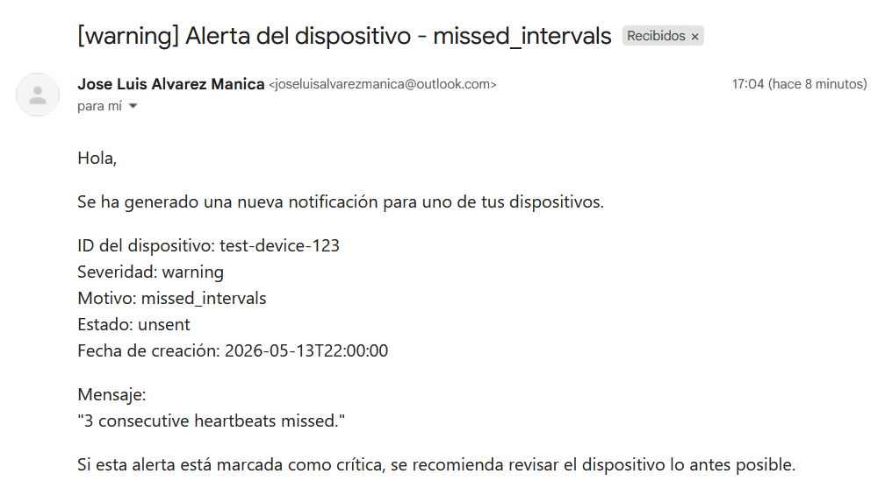
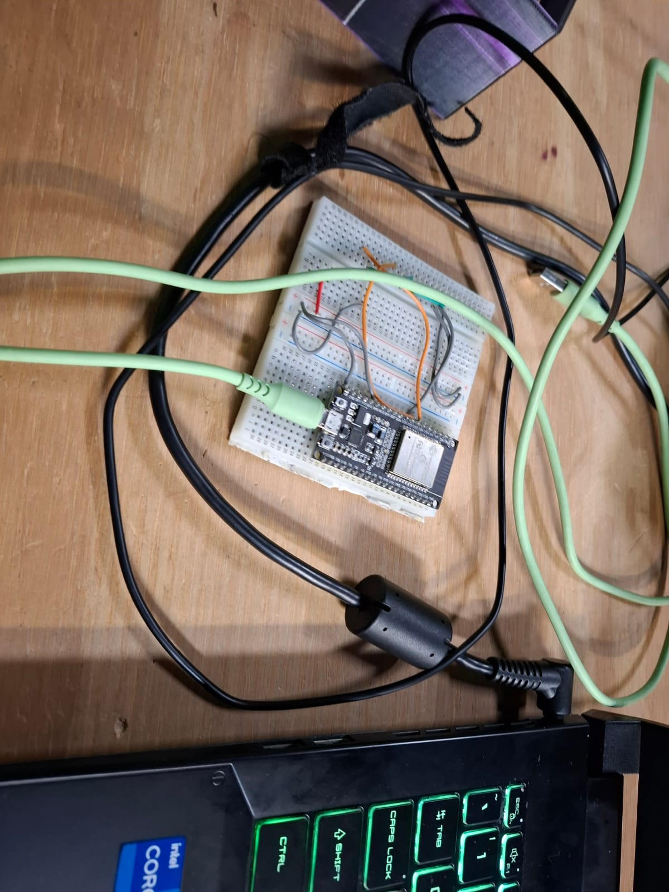

# Pruebas — Ioteur

---

## Estrategia de Pruebas

El proyecto cuenta con cuatro niveles de pruebas automatizadas ejecutadas a través de **GitHub Actions** sobre el entorno Docker Compose completo, más pruebas manuales realizadas con Postman:

| Nivel | Herramienta | Workflow |
|---|---|---|
| Calidad de código | Ruff (lint + format) | `ruff-check.yml` |
| Integración (curl) | Bash + cURL | `curl_endpoint_testing.yml` |
| Integración (pytest) | pytest + aio-pika + httpx + motor | `pytest_integration.yml` |
| E2E completo | pytest + requests | `pytest_e2e.yml` |
| Notificación EmailJS | pytest | `pytest_mailJS.yml` |
| Manual | Postman | `evidence/postman/` |

Todos los workflows de integración y E2E levantan el stack completo con `docker compose -f docker-compose.yml -f docker-compose.dev.yml up -d --build`, inyectan credenciales desde GitHub Secrets y realizan teardown con `docker compose down -v` al finalizar.

---

## Herramientas Utilizadas

- **Ruff** — linter y formateador de código Python, ejecutado en cada push a cualquier rama.
- **cURL + Bash** — scripts de prueba de endpoints con validación de código HTTP.
- **pytest + aio-pika + httpx + motor** — pruebas de integración asíncronas sobre RabbitMQ y MongoDB.
- **pytest + requests** — pruebas E2E sobre el API Gateway en `localhost:8000`.
- **Postman** — colección de 22 requests agrupados en 6 carpetas para pruebas manuales. Ver [`evidence/postman/`](../evidence/postman/).
- **Logs de Docker** — trazabilidad con `docker compose logs -f <servicio>`.

---

## Pruebas Automatizadas — GitHub Actions

### 1. Calidad de Código — `ruff-check.yml`

Se ejecuta en **cada push a cualquier rama** y en pull requests. Corre dos pasos:

- `ruff check . --no-fix` — detecta errores de lint en todos los servicios Python.
- `ruff format . --check --diff` — verifica que el formato sea consistente sin modificar archivos.

Si alguno de los dos falla, el workflow bloquea el merge.

---

### 2. Pruebas de Integración con cURL — `curl_endpoint_testing.yml`

Se ejecuta en pushes y PRs a `main` y `develop`. Levanta el stack completo y ejecuta dos scripts bash:

**`auth_curl_tests.sh`** — prueba directamente `auth-service` en `localhost:8001`:

| Test | Request | Código esperado |
|---|---|---|
| `signup_ok` | `POST /auth/signup` con datos válidos | 201 |
| `signup_conflict` | `POST /auth/signup` con email duplicado | 409 |
| `admin_register_ok` | `POST /auth/admin/register` | 201 |
| `login_ok` | `POST /auth/login` con credenciales correctas | 200 |
| `login_bad_creds` | `POST /auth/login` con contraseña incorrecta | 401 |
| `me_ok` | `GET /auth/me` con token válido | 200 |
| `me_no_token` | `GET /auth/me` sin token | 401 |
| `me_bad_token` | `GET /auth/me` con token malformado | 401 |
| `refresh_ok` | `POST /auth/refresh` con tokens válidos | 200 |

**`gateway_curl_tests.sh`** — prueba el API Gateway en `localhost:8000` con un admin creado directamente en auth-service (bypass del gateway para bootstrap). Verifica los mismos flujos de autenticación pero pasando por el gateway con el header `Authorization: Bearer`.

---

### 3. Pruebas de Integración con Pytest — `pytest_integration.yml`

Se ejecuta en pushes y PRs a `main` y `develop`. Espera que `register-service` (puerto 8005) y `notification-service` (puerto 8004) estén healthy antes de correr.

**`test_register_flow.py`** — prueba el flujo de telemetría completo vía RabbitMQ:

| Test | Descripción |
|---|---|
| `test_health` | Verifica que `/health` retorna `status=healthy` y que mongo y rabbitmq son healthy |
| `test_register_flow` | Publica mensaje `device.register` a exchange `ioteur` vía aio-pika, hace polling a `GET /registers/{device_id}` hasta 15s, verifica que el registro contiene `device_id`, `values`, `time_procesing`, `id` y `created_at` |
| `test_unknown_device_returns_empty` | Verifica que un `device_id` inexistente retorna `[]` |

**`test_notification_flow.py`** — prueba el flujo de notificaciones vía RabbitMQ + MongoDB:

Publica mensajes `system.error` al exchange `ioteur` y verifica que el notification-service los consume e inserta la notificación en la colección `system_notifications` de MongoDB.

---

### 4. Pruebas E2E — `pytest_e2e.yml`

Se ejecuta en pushes a `main` y manualmente (`workflow_dispatch`). Levanta el stack con `--wait` (espera todos los healthchecks) y ejecuta `test_e2e.py` que cubre el flujo completo end-to-end a través del API Gateway en `localhost:8000`:

| Paso | Test | Request |
|---|---|---|
| 1 | `test_01_signup` | `POST /auth/signup` → 201 |
| 2 | `test_02_login` | `POST /auth/login` → 200, extrae `access_token` |
| 3 | `test_03_decode_jwt` | Decodifica el JWT y extrae `user_id` del campo `sub` |
| 4 | `test_04_register_device` | `POST /devices/register` → 202, polling hasta que el dispositivo aparece |
| 5+ | Registros + reports | `POST /registers/received` ×5, polling `GET /registers/{device_id}`, `GET /reports/{device_id}` |

---

### 5. Pruebas de EmailJS — `pytest_mailJS.yml`

Se ejecuta en pushes a `main` y manualmente. Verifica que el notification-service envía correctamente notificaciones por correo mediante la integración con EmailJS cuando se detecta un dispositivo desconectado.

**Evidencia — correo generado:**



---

## Pruebas Manuales — Postman

La colección [`evidence/postman/Ioteur_API_Gateway.postman_collection.json`](../evidence/postman/Ioteur_API_Gateway.postman_collection.json) contiene 22 requests agrupados en 6 carpetas:

| Carpeta | Contenido |
|---|---|
| **Auth** | signup, login (con script que guarda tokens), me, refresh, logout, update user, get by email |
| **Devices** | register, get by user, get by id, update |
| **Registers (Telemetría)** | received, get all, get by date |
| **Reports** | generate, get all, get by date |
| **Bootstrap** | `POST http://localhost:8001/auth/admin/register` directo al auth-service (para crear el primer admin sin pasar por el gateway) |
| **System (Internal)** | `POST /system/error` con header `x-internal-key` |

Los requests de login y refresh tienen **scripts de test** que guardan automáticamente `access_token`, `refresh_token`, `user_id` y `device_uuid` como variables de colección.

La evidencia de ejecución manual se encuentra en [`evidence/postman/Evidencia_Pruebas_Postman.pdf`](../evidence/postman/Evidencia_Pruebas_Postman.pdf).

---

## Prueba Manual — Ciclo Activo / Inactivo de Dispositivo

Esta prueba verifica de forma manual el flujo completo de detección de inactividad: desde que un dispositivo deja de reportar telemetría hasta que el sistema lo marca como `inactive`, publica el evento `device.disconnected` y el Notification Service envía el correo de alerta.

### Configuración Previa

Para esta prueba se registró previamente un usuario y un dispositivo físico (ESP32) a través del API Gateway.

**Paso 1 — Obtener la MAC del ESP32:**

Se cargó el siguiente sketch en el ESP32 para leer su dirección MAC por puerto serie:

```cpp
#include <WiFi.h>

void setup() {
  Serial.begin(115200);

  uint8_t mac[6];
  WiFi.macAddress(mac);

  Serial.printf("MAC: %02X:%02X:%02X:%02X:%02X:%02X\n",
    mac[0], mac[1], mac[2], mac[3], mac[4], mac[5]);
}

void loop() {}
```

La MAC obtenida fue `CC:DB:A7:94:8B:D8`, con la cual se registró el dispositivo en el sistema y se obtuvo el UUID `9e5bfdbf-8340-4c95-930a-2073a2c750fa`.

**Paso 2 — Envío de telemetría desde el ESP32:**

Con el UUID obtenido se programó el siguiente sketch para enviar datos periódicamente al API Gateway desde la red local (WiFi):

```cpp
#include <WiFi.h>
#include <HTTPClient.h>

const char* ssid = "MSI 9472";
const char* password = "a1a2a3a4";
const char* serverUrl = "http://172.18.53.251:8000/registers/received";

const char* device_id = "9e5bfdbf-8340-4c95-930a-2073a2c750fa";
const int report_interval = 30; // segundos

void setup() {
  Serial.begin(115200);
  WiFi.begin(ssid, password);
  while (WiFi.status() != WL_CONNECTED) {
    delay(500);
    Serial.print(".");
  }
  Serial.println("\nWiFi conectado");
}

void loop() {
  if (WiFi.status() == WL_CONNECTED) {
    HTTPClient http;
    http.begin(serverUrl);
    http.addHeader("Content-Type", "application/json");

    String jsonPayload = String("{") +
      "\"device_id\":\"" + device_id + "\"," +
      "\"time_procesing\":123," +
      "\"values\":{" +
        "\"temperature\":" + String(random(20, 30)) + "," +
        "\"humidity\":" + String(random(40, 60)) +
      "}" +
    "}";

    int httpResponseCode = http.POST(jsonPayload);

    Serial.print("POST enviado, código: ");
    Serial.println(httpResponseCode);
    if (httpResponseCode > 0) {
      String response = http.getString();
      Serial.println("Respuesta: " + response);
    } else {
      Serial.println("Error en POST");
    }
    http.end();
  } else {
    Serial.println("WiFi no conectado");
  }

  delay(report_interval * 1000);
}
```

El sketch envía un `POST /registers/received` cada 30 segundos con valores de temperatura y humedad aleatorios.

**Dispositivo físico utilizado:**



### Precondiciones

- Stack completo levantado con `docker compose -f docker-compose.yml -f docker-compose.dev.yml up -d --build`.
- Usuario y dispositivo `ESP32-1` registrados previamente (ver configuración previa).
- `report_interval` del dispositivo: `30s` → umbral de inactividad: `90s`.
- El dispositivo se encontraba con `status: inactive` en Redis por pruebas anteriores.

### Pasos Ejecutados

| Paso | Acción | Resultado esperado |
|---|---|---|
| 1 | Conectar el ESP32 (que estaba inactivo) y verificar en Redis | `status` cambia de `inactive` a `active` |
| 2 | Confirmar que los logs del Call Service registran la reconexión | Log `device.reconnected` con restauración a `active` |
| 3 | Detener el envío de telemetría (desconectar el ESP32) | Call Service deja de recibir heartbeats |
| 4 | Esperar que el scheduler detecte la inactividad (≥ 90s sin telemetría) | Call Service publica `device.disconnected` y `device.update` |
| 5 | Verificar estado en Redis tras la detección | `status: inactive` |
| 6 | Verificar que el Notification Service recibió el evento y envió el correo | Correo recibido con `reason: inactivity_timeout` |
| 7 | Dejar el sistema corriendo ~5 minutos sin reconectar el dispositivo | No se genera un segundo correo (un solo correo por estado de inactividad) |

### Evidencia

**Log del Call Service — detección y publicación:**
```
call-service | device.connected  | Updated device.connected for 9e5bfdbf-...
call-service | scheduler detecta 189s sin telemetría (umbral: 90s)
call-service | device.update (inactive) publicado a RabbitMQ
call-service | device.disconnected publicado a RabbitMQ
```

**Redis — estado `active` (antes):**


**Redis — estado `inactive` (después):**


**Correo recibido (Notification Service vía EmailJS):**

- **Dispositivo:** `9e5bfdbf-8340-4c95-930a-2073a2c750fa` (ESP32-1)
- **Severidad:** `warning`
- **Motivo:** `inactivity_timeout`
- **Mensaje:** `"Device 'ESP32-1' has not sent telemetry for 189s (threshold: 90s). It has been marked as inactive."`


**Logs del servicio:** [`evidence/logs/device-active-inactive.log`](../evidence/logs/device-active-inactive.log)

---

## Evidencias

| Evidencia | Ubicación |
|---|---|
| Correo de notificación EmailJS | [`evidence/screenshots/Evidence_EmailJS.png`](../evidence/screenshots/Evidence_EmailJS.png) |
| Colección Postman (JSON) | [`evidence/postman/Ioteur_API_Gateway.postman_collection.json`](../evidence/postman/Ioteur_API_Gateway.postman_collection.json) |
| PDF de pruebas manuales Postman | [`evidence/postman/Evidencia_Pruebas_Postman.pdf`](../evidence/postman/Evidencia_Pruebas_Postman.pdf) |
| Logs de ejecución Docker | [`evidence/logs/`](../evidence/logs/) |
| Logs ciclo activo/inactivo | [`evidence/logs/device-active-inactive.log`](../evidence/logs/device-active-inactive.log) |
